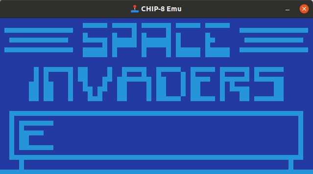
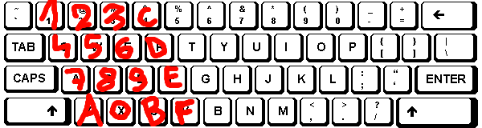

# Introduction



This project is a [CHIP-8](https://en.wikipedia.org/wiki/CHIP-8) interpreter written in Python. CHIP-8 is an interpreted language from the 70's that can run simple video-games.

Making a CHIP-8 interpreter is a classing learner's programming project. I made mine (the implementation in this repository) in 2013, after making [green-snake](https://github.com/a-robu/green-snake) and [py-asteroird](https://github.com/a-robu/py-asteroird).

For convenience, I included [Zophar's Chip 8 rom pack](https://www.zophar.net/pdroms/chip8/chip-8-games-pack.html) in [zophars-rom-pack/](zophars-rom-pack/).

# How to Play

Computers that ran CHIP-8 had a hexadecimal keyboard with keys from 1 to F, arranged in a 4 by 4 grid.

This interpreter maps them to QWERTY keyboards as shown in the following drawing.



# Keyboard Game Controlls

Each game has its own control scheme. Some of them are shown in the table below for convenience.

| Game     | Actions                   | CHIP8 Keys | QWERTY Keys |
|----------|---------------------------|------------|-------------|
| INVADERS | Left, Fire, Right         | 4, 5, 6    | Q, W, E     |
| TETRIS   | Drop, Rotate, Left, Right | 7, 4, 5, 6 | A, Q, W, E  |
| PONG     | Up, Down for P1, P2       | 1, 4, C, D | 1, Q, 4, R  |

# Running from Source

This assumes that Python 2 is installed. Install the required dependencies in a _virtualenv_ with the following commands.

```bash
virtualenv venv
. venv/bin/activate
pip install -r requirements.txt
python chip8emu.py zophars-rom-pack/INVADERS
```
